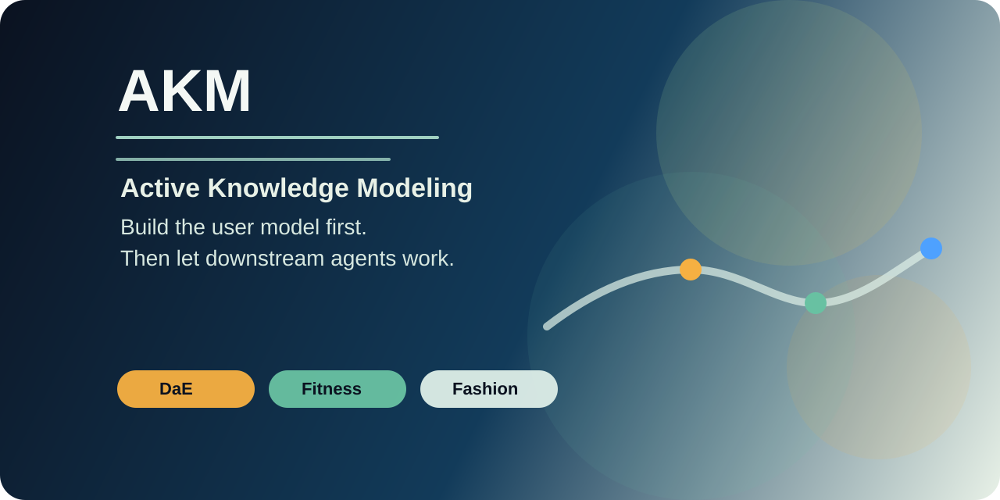

<!--
文件：README.zh-CN.md
核心功能：作为 AKM 母港的中文入口页，提供与英文主页对应的定位语、双语切换、快速导航、分支地图、研究入口、benchmark 入口与生态仓链接，并明确 AKM 对主流平台上下文承载面的上游方法论定位。
输入：AKM 母定义、母论文入口、DaE/Fitness/Fashion 分支入口、synthetic-profile benchmark、旧 DaE 公共仓链接与状态信息。
输出：供 GitHub 中文读者理解 AKM 方法框架、分支资产与 benchmark 复现实验的中文 README。
-->

# AKM - 主动知识建模

  

  
  
  
  
  

  <a href="./README.md">English</a> | <a href="./README.zh-CN.md">简体中文</a>

  <a href="#快速开始">快速开始</a> |
  <a href="#什么是-akm">核心概念</a> |
  <a href="#分支地图">分支地图</a> |
  <a href="#研究入口">研究入口</a> |
  <a href="#生态仓">生态仓</a>

**OpenClaw、ChatGPT、Gemini 这类平台已经提供了用户与 agent 状态的上下文承载面。AKM 要解决的，是这些承载面里的状态该如何被挖掘、结构化、更新和回灌。**

AKM 是一套面向 AI 协作的主动式、结构化用户建模框架。
它把画像构建视为基础设施，而不是对话修饰。

OpenClaw、ChatGPT、Gemini 这类平台都允许用户提供上下文。
其中 OpenClaw 通过 injected workspace files 和 system-prompt reconstruction 把这件事做得最显式，例如 `USER.md`、`IDENTITY.md`、`AGENTS.md`、`MEMORY.md` 这样的文件会被纳入上下文重建。真正缺失的，往往不是输入框，而是如何主动挖掘、结构化记录、更新，再把这些信息稳定回灌到下游任务里的方法。
AKM 定义的，就是这一层上游方法。

OpenClaw 官方依据：[Context](https://docs.openclaw.ai/context/)、[System Prompt](https://docs.openclaw.ai/concepts/system-prompt)、[USER Template](https://docs.openclaw.ai/templates/USER)、[IDENTITY Template](https://docs.openclaw.ai/reference/templates/IDENTITY)、[AGENTS Template](https://docs.openclaw.ai/reference/templates/AGENTS)、[Memory](https://docs.openclaw.ai/concepts/memory)

> 学术入口：母论文已上传 SSRN（Abstract ID **6708819**，等待 SSRN 审核通过后公开页面）+ arXiv（Submission ID **7549904**，cs.AI，on hold 等 moderation）。当前入口见 [AKM Mother Paper](./papers/akm/README.md)

---

## 什么是 AKM？

`Active Knowledge Modeling (AKM)` 指的是：

- 系统主动挖掘用户信息，而不是等待用户一次性写出完美 prompt
- 把挖出的信息整理成可复用的上游资产
- 在规划、写作、顾问、编码、执行前，把这些资产注入工作流

AKM 之所以存在，是因为很多 AI 系统虽然已经有上下文承载面，却没有一套严肃的填法：

- 目标未排序就开始规划
- 约束未澄清就开始建议
- 现有资产未建模就开始推荐
- 偏好与决策逻辑被默认存在

---

## 快速开始

1. 先读 [AKM.md](./AKM.md)
2. 再读 [AKM Mother Paper](./papers/akm/README.md)
3. 然后按场景进入分支：
   - [DaE](./branches/dae/README.md)：Persona / 顾问协作
   - [Fitness](./branches/fitness/README.md)：真实约束下的训练决策
   - [Fashion](./branches/fashion/README.md)：真实约束下的衣橱与穿搭决策

---

## 分支地图

| 分支 | 场景 | 核心上游资产 | 状态 |
| --- | --- | --- | --- |
| [DaE](./branches/dae/README.md) | Persona / 顾问协作 | `PersonaProfile` | 首个完整 AKM 参考实现 |
| [Fitness](./branches/fitness/README.md) | 训练约束、恢复、器械与日级训练决策 | `FitnessProfile` | 分支论文 + 双语 skill 包 |
| [Fashion](./branches/fashion/README.md) | 体型、场景、衣橱资产与穿搭 / 采购决策 | `FashionProfile` | 分支论文 + 双语 skill 包 |

### 这些分支为什么重要

- **DaE** 证明了 AKM 在 persona 感知顾问协作中的完整实现。
- **Fitness** 展示了 AKM 如何处理身体限制、器械现实与恢复不确定性。
- **Fashion** 展示了 AKM 如何处理衣橱限制、体型语境、场景要求与采购取舍。

---

## 研究入口

### 母论文

- [AKM Mother Paper](./papers/akm/README.md)
- 仓内 PDF：[AKM-main.pdf](./papers/akm/AKM-main.pdf)
- SSRN Abstract ID **6708819**（PRELIMINARY_UPLOAD，等 SSRN 审批；通过后页面会出现在 `https://papers.ssrn.com/sol3/papers.cfm?abstract_id=6708819`）
- arXiv Submission ID **7549904**（cs.AI，on hold 等 moderation；通过后会有 `https://arxiv.org/abs/<id>` 形式的正式 URL）

### 分支论文

| 分支 | SSRN Abstract ID | 状态 |
|---|---|---|
| [DaE](./branches/dae/paper/README.md) | **6708998** | PRELIMINARY_UPLOAD |
| [Fitness](./branches/fitness/paper/README.md) | **6709039** | PRELIMINARY_UPLOAD |
| [Fashion](./branches/fashion/paper/README.md) | **6709078** | PRELIMINARY_UPLOAD |

### Benchmark Toolkit

- **[AKM-Benchmark-Toolkit v1.0](./experiments/synthetic_profile_eval/README.md)**：50 personas × 4 conditions × 3 cross-family judges = 600 盲评，DeepSeek-V4-pro 单生成器，Krippendorff α = 0.948。
- **[v1.1 多生成器补充实验](./experiments/synthetic_profile_eval/supplement_v1.1.md)**：把 v1.0 实验在 5 个跨家族生成器上重做（DeepSeek / GPT-5.4-mini / Qwen3.6-Plus / GLM-5.1 / Gemma-4-31b-it），每家全 N=50（GLM 49/50），AKM 相对 no_profile 的 lift 在 5/5 模型上稳定为 +14.56 ~ +19.81。第六个尝试模型 Kimi-K2.6 因 OpenRouter 端持续返空（39% 完成度）被列为 attempted-but-excluded，原始数据保留供审计但不进入主分析。诚实披露 GLM ceiling 比其他强模型低 5 分；Gemma 被 OpenRouter 重度限速但跑齐了 50/50。验证脚本：`python experiments/synthetic_profile_eval/verify_v11.py`。

---

## 生态仓

- [AKM 母港](https://github.com/sirsws/akm)
- [DaE skill 仓](https://github.com/sirsws/dae-persona-context-injector)
- [DaE research 仓](https://github.com/sirsws/DaE-Personal-Strategic-Asset)

这两个 DaE 仓仍是公开历史入口，但现在都回链到 AKM 母港结构。

---

## 当前状态

- AKM 母定义：已完成
- AKM 母论文 / DaE / Fitness / Fashion：均已上传 SSRN（PRELIMINARY_UPLOAD 状态，等审批通过后公开 URL；4 个 Abstract ID 见研究入口章节）；母论文同步上传 arXiv（cs.AI，Submission ID 7549904，on hold 等 moderation）
- DaE 分支：AKM 的首个完整参考实现
- Fitness 分支：分支论文 + 双语 skill 包已可用
- Fashion 分支：分支论文 + 双语 skill 包已可用
- Benchmark v1.0：50 personas, 600 judgments, fully reproducible
- Benchmark v1.1：5-generator 补充实验，AKM lift holds on 5/5（Kimi-K2.6 因 OpenRouter 端失败被列为 attempted-but-excluded）
- 双语公开层：README、paper、skill 与 prompt 文件已统一

---

## 许可证

本仓库采用 [Apache License 2.0](./LICENSE)。

