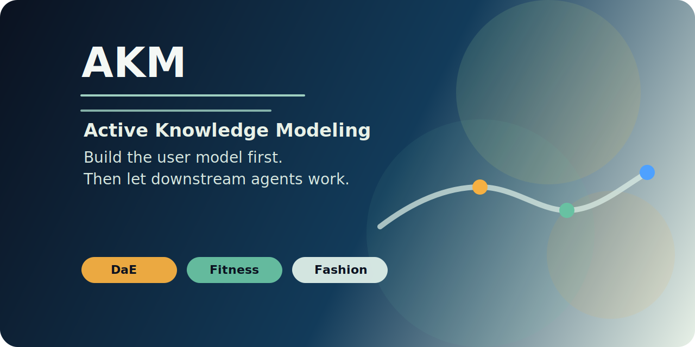

<!--
文件：README.md
核心功能：作为 DaE 分支在 AKM 母港中的英文主入口，说明分支定位、场景范围、核心资产与入口导航。
输入：AKM 母定义、DaE 发布资产与研究资产。
输出：供 GitHub 分支页直接展示的英文 README。
-->

# DaE — AKM Reference Implementation

  

  
  
  

  <a href="./README.md">English</a> | <a href="./README.zh-CN.md">简体中文</a>

**DaE is the reference implementation of AKM for persona-aware advisory and collaboration workflows.**

## Scope

DaE operationalizes AKM in workflows where downstream quality depends on a reusable user profile.
Its primary scene is persona-aware collaboration across planning, advisory, and multi-agent work.

## Core Asset

The central upstream asset is `PersonaProfile`.
It captures structured user context for reuse across downstream tasks rather than rebuilding context from scratch in every session.

## Why This Branch Exists

DaE demonstrates that user modeling can function as upstream infrastructure.
Instead of treating profile construction as optional prompting style, it treats profile construction as a required precondition for higher-quality downstream collaboration.

## Deliverables

- branch overview and framing
- paper entry for the DaE research line
- skill entry for operational use
- reference materials for prompt and acceptance criteria

## Entry Points

- [Paper](./paper/README.md)
- [Skill](./skill/README.md)
- [AKM Mother Hub](../../README.md)