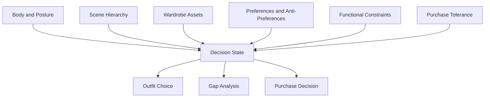

<!--
文件：manuscript.md
核心功能：作为 Fashion 分支论文的英文 markdown 稿，说明 AKM 如何在衣橱与场景决策中把穿搭重写成画像优先的决策系统，并明确其对主流平台上下文承载面的上游方法论补位。
输入：穿搭私有系统、本地设计记录、衣橱资产信息与外部个性化推荐文献。
输出：供人工审阅、GitHub 展示和后续 LaTeX 转换使用的英文长稿。
-->

# Profile-First Wardrobe Planning Under Real Constraints: An AKM Branch Paper

## Abstract

Platforms such as OpenClaw, ChatGPT, and Gemini already provide persistent context surfaces for user and agent state, but they provide little guidance on how the state behind those surfaces should be elicited, structured, updated, and reused for real wardrobe decisions. OpenClaw makes this especially explicit through injected workspace files and system-prompt reconstruction. This paper presents the fashion branch of `Active Knowledge Modeling (AKM)` as a profile-first method for wardrobe planning under scene, asset, and functional constraints. Instead of generating styling output first, the branch elicits and structures body context, scene requirements, wardrobe assets, anti-preferences, purchase tolerance, and practical limits before producing an outfit or purchase recommendation. The contribution is methodological rather than benchmark-driven. The branch shows how styling workflows can be redesigned so that upstream user modeling becomes a stable decision layer rather than an afterthought attached to generic taste language.

## 1. Introduction

Platforms such as OpenClaw, ChatGPT, and Gemini already provide persistent context surfaces for user and agent state, but they rarely provide a rigorous method for constructing the state that should populate them. OpenClaw makes this especially explicit through injected workspace files and system-prompt reconstruction. Styling systems expose the gap clearly. Generic outfit advice often assumes that body shape, wardrobe inventory, scene demands, and functional limits are already known or can be safely guessed.

The problem is upstream. If outfit quality depends on body context, scene logic, wardrobe reality, and functional tradeoffs, then the system should not begin with a suggestion. It should begin with a model of what the user actually owns, needs, rejects, and can plausibly wear. The central claim of this branch paper is therefore narrow but consequential: a wardrobe-planning agent becomes useful only after profile construction is formalized as a method, not when it is treated as a side note in a prompt.

This claim matters because modern styling tools already operate inside ecosystems where persistent context surfaces exist but method is missing. Personalized recommendation research has long shown that item compatibility, scene fit, explainability, and user preference structure matter for output quality [1]-[8]. Recent work on alignment debt, human-AI collaboration, and preference elicitation adds a parallel lesson: useful systems require real upstream modeling work rather than downstream improvisation [9]-[12]. The fashion branch of AKM operationalizes that lesson for wardrobe decision systems.

## 2. Problem Landscape

Wardrobe planning looks deceptively simple when reduced to taste language. A typical prompt asks for a business-casual look, a minimalist wardrobe, or a better summer outfit. What disappears in this simplification is the decision structure that real users actually face. They do not choose among abstract aesthetics. They choose among available garments, climate conditions, body constraints, comfort limits, maintenance burden, scene expectations, and replacement priorities.

When upstream context is weak, generic styling prompts degrade in predictable ways:

- body shape becomes a vague aesthetic label instead of a decision variable
- scene requirements are flattened into broad style categories
- wardrobe assets are assumed rather than modeled
- functional constraints are treated as optional details
- purchase advice is detached from existing wardrobe structure
- anti-preferences are under-specified and later violated by the model
- wardrobe gaps are confused with random shopping opportunities

These failures align with a broader lesson from personalized recommendation research: recommendation quality depends on explicit user state, asset modeling, and explainable constraint handling rather than on loose taste language alone [1]-[7]. `LaMP` and related personalization work also make clear that personalization is not just a better generation trick; it depends on a retrievable and structured representation of user state [8]. AKM treats wardrobe planning as exactly this upstream state-construction problem.

## 3. Why Existing Platform Context Surfaces Are Insufficient

The existence of a profile surface or a system prompt layer does not solve the wardrobe problem by itself. A platform can store or inject information, but it does not define what should be extracted, how it should be stabilized, when it should be updated, or how conflicting constraints should be resolved. In fashion workflows this gap becomes visible very quickly.

A user can write "I prefer clean and mature looks" into a profile field, but that statement leaves open almost every variable that matters in practice: which silhouettes are flattering, what inventory already exists, which colors are overrepresented, what functional requirements dominate commuting, whether pockets matter, whether the user tolerates layering, or whether purchases should optimize replacement, versatility, or experimentation.

The insufficiency of platform context surfaces can therefore be stated more formally. Existing platform surfaces are storage or injection surfaces. They are not elicitation protocols, not record schemas, and not decision contracts. They can host AKM outputs, but they do not specify how those outputs should be built. Without an upstream method, the downstream agent keeps guessing. The branch paper is about defining that upstream method for wardrobe systems.

## 4. Branch Method

In the fashion scene, AKM models wardrobe feasibility rather than abstract identity. The relevant upstream state includes body shape and posture notes, primary scenes, wardrobe assets already owned, style preferences and anti-preferences, functional constraints, purchase tolerance, replacement logic, and maintenance burden. The branch is implemented as a four-step workflow.


### 4.1 Elicitation

The system first asks what kind of outfit decision is even valid. It clarifies scenes, body context, preference structure, functional limits, wardrobe inventory, and purchase tolerance before recommending anything. The elicitation layer is not a social conversation add-on. It is the extraction protocol for building the wardrobe state that later recommendations must obey.

### 4.2 Structured Record

The elicited information is converted into persistent upstream state through wardrobe records, scene maps, anti-pattern notes, and purchase-priority records. This is the branch point where a loose stylist conversation is transformed into a maintainable operator system.

### 4.3 Execution Decision

Only after profile and current wardrobe state are available does the system produce a decision. The output contract includes the following fields:

- `SceneJudgment`
- `OutfitRecommendation`
- `WhyThisWorks`
- `GapAnalysis`
- `PurchasePriority`
- `DoNotBuy`

### 4.4 Update Cycle

Wardrobe systems drift if they are not updated. Garments wear out, scenes change, seasonal constraints shift, and purchases alter the compatibility structure of the wardrobe. AKM therefore treats outfit planning as a maintained state rather than a one-shot answer. The update cycle is part of the method, not an optional bookkeeping step.

## 5. Variable Structure

The branch can be represented as a constraint map rather than a taste map.



This structure matters because it separates variables that users often compress into a single sentence. Body context is not the same as scene logic. Scene logic is not the same as wardrobe inventory. Inventory is not the same as style preference. Functional constraints such as commuting, pockets, temperature tolerance, maintenance cost, or fabric comfort are not decorative details; they are veto-capable variables. The branch becomes useful only when these variables are made explicit and persisted.

## 6. Design Record and Reference Trace

The branch is documented through a long-running private styling system and then translated into public-facing assets. The purpose of the design record is not to prove universal fashion performance. It is to make visible what kind of upstream state the branch stores and how that state changes the shape of downstream recommendations.


Table 1 summarizes the core record types used by the branch.

| Record type | Role in the branch | Typical update trigger |
| --- | --- | --- |
| Body and posture note | Keeps outfit advice tied to silhouette and fit reality | Weight change, new posture insight, fit failure |
| Scene map | Ranks scenes instead of treating style as context-free | New work mode, travel pattern, seasonal switch |
| Wardrobe inventory record | Prevents the model from hallucinating garments or gaps | New purchase, retirement, item failure |
| Anti-preference note | Stores what should be ruled out even if fashionable | Repeated rejection, comfort failure |
| Purchase-priority list | Converts shopping from impulse to structural repair | Recurring wardrobe gap, low versatility, wear-out |

A representative decision trace is shown below in abbreviated JSON form.

```json
{
  "Scene": "city commuting plus semi-formal meetings",
  "BodyContext": ["shorter leg line", "needs clean vertical structure"],
  "WardrobeAssets": ["navy overshirt", "grey wool trousers", "white sneakers"],
  "AntiPreferences": ["bulky streetwear", "large logo graphics"],
  "FunctionalConstraints": ["walkability", "usable pockets", "easy maintenance"],
  "Decision": {
    "OutfitRecommendation": "navy overshirt + light knit + grey wool trousers + white sneakers",
    "WhyThisWorks": "maintains clean vertical lines while staying commute-friendly",
    "GapAnalysis": "outer layer versatility acceptable; footwear rotation remains thin",
    "PurchasePriority": "dark leather sneaker or derby-level substitute",
    "DoNotBuy": "heavy oversized bomber"
  }
}
```

The value of this trace is structural. It shows that the branch does not jump directly from vague taste language to a shopping suggestion. It first stabilizes scene, body, inventory, anti-preference, and function, and only then allows a recommendation to emerge.

## 7. Comparative Discussion

The branch becomes easier to evaluate when compared with two simpler upstream strategies: generic prompting and memory-only context storage.

| Strategy | Upstream state handling | Typical failure in wardrobe planning |
| --- | --- | --- |
| Generic prompting | Reconstructs context from each prompt | Repeats intake, guesses inventory, ignores anti-preferences |
| Memory-only storage | Stores notes but lacks a stable schema | Context drifts, important constraints are unevenly retrieved |
| AKM fashion branch | Uses elicitation, schema, execution contract, and update loop | Higher setup cost, but lower drift and better purchase discipline |

This comparison shows why the branch should not be reduced to a stylish prompt. The methodological gain comes from formalizing how state is collected, stored, and reused. The cost is real: the branch requires disciplined intake and maintenance. But this cost is precisely what alignment-debt and human-AI collaboration research would predict [10]-[11]. Systems become more useful when hidden coordination work is made explicit and reusable.

The branch also differs from mainstream recommendation papers. Most recommendation literature optimizes item ranking, compatibility prediction, or explainability inside fixed datasets [1]-[7]. The fashion branch instead focuses on the operator problem that appears before dataset-like inputs even exist: how a real user constructs and maintains the state that a downstream agent should honor.

## 8. Boundaries and Failure Modes

The branch has several boundaries.

First, it is not an image-understanding system. It assumes that wardrobe assets can be described or catalogued, not magically inferred. Second, it is not a fashion-trend engine. If the user wants novelty without wardrobe coherence, the branch is the wrong tool. Third, it does not remove taste conflict. A structured record can stabilize constraints, but it cannot eliminate the possibility that the user wants mutually incompatible outcomes such as maximum versatility, minimal spending, strong individuality, and zero maintenance burden at the same time.

Failure modes are therefore predictable. The branch weakens when wardrobe inventory is stale, when anti-preferences are not recorded, when scenes are inaccurately ranked, or when purchase decisions ignore replacement logic. It also weakens when the public branch assets are used without enough intake depth. In those cases the system can still produce fluent styling language, but fluency should not be mistaken for grounded judgment.

## 9. Conclusion

The fashion branch of AKM argues that wardrobe planning should be treated as an upstream modeling problem rather than a downstream styling prompt. Existing platforms already provide places where user context can be stored, but they do not provide a disciplined method for deciding what that context should contain. AKM supplies that missing layer by defining a branch workflow that elicits, records, applies, and updates the variables that make outfit and purchase decisions coherent.

The broader implication is not limited to fashion. Wardrobe planning simply makes the gap visible because constraints, assets, and preferences are tightly coupled. The same lesson extends to other profile-first systems: if the upstream state is not built with care, downstream outputs remain generic no matter how fluent the model becomes.

## References

[1] Lu, Z., Hu, Y., Jiang, Y., Chen, Y., & Zeng, B. (2019). *Learning Binary Code for Personalized Fashion Recommendation*. CVPR 2019.

[2] Kang, W.-C., Kim, E., Leskovec, J., Rosenberg, C., & McAuley, J. (2019). *Complete the Look: Scene-Based Complementary Product Recommendation*. CVPR 2019.

[3] Lu, Z., Jiang, Y., Hu, Y., Chen, Y., & Zeng, B. (2021). *Personalized Outfit Recommendation with Learnable Anchors*. CVPR 2021.

[4] Sarkar, R., Bodla, N., Vasileva, M., Lin, Y.-L., Beniwal, A., Lu, A., & Medioni, G. (2022). *OutfitTransformer: Outfit Representations for Fashion Recommendation*. CVPRW 2022.

[5] Li, L., Zhang, Y., & Chen, L. (2021). *Personalized Transformer for Explainable Recommendation*. ACL 2021.

[6] Cheng, H., Wang, S., Lu, W., Zhang, W., Zhou, M., Lu, K., & Liao, H. (2023). *Explainable Recommendation with Personalized Review Retrieval and Aspect Learning*. ACL 2023.

[7] Hsiao, W.-L., & Grauman, K. (2018). *Creating Capsule Wardrobes from Fashion Images*. CVPR 2018.

[8] Salemi, A., Aliannejadi, M., Crestani, F., & Croft, W. B. (2023). *LaMP: When Large Language Models Meet Personalization*. arXiv:2304.11406.

[9] White, J., Fu, Q., Hays, S., Sandborn, P., Olea, C., Gilbert, H., Elnashar, A., Spencer-Smith, J., & Schmidt, D. C. (2023). *A Prompt Pattern Catalog to Enhance Prompt Engineering with ChatGPT*. arXiv:2302.11382.

[10] Oyemike, C., Akpan, E., & Herve-Berdys, P. (2025). *Alignment Debt: The Hidden Work of Making AI Usable*. arXiv:2511.09663.

[11] Holstein, J., Hemmer, P., Satzger, G., & Sun, W. (2025). *When Thinking Pays Off: Incentive Alignment for Human-AI Collaboration*. arXiv:2511.09612.

[12] Foschini, M., Defresne, M., Gamba, E., Bogaerts, B., & Guns, T. (2025). *Preference Elicitation for Step-Wise Explanations in Logic Puzzles*. arXiv:2511.10436.


