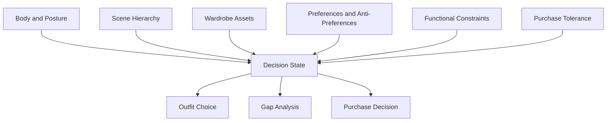

<!--
文件：manuscript.zh-CN.md
核心功能：作为 Fashion 分支论文的中文 markdown 稿，说明 AKM 如何在衣橱与场景决策中把穿搭重写成画像优先的决策系统，并明确其对主流平台上下文槽位的上游方法论补位。
输入：穿搭私有系统、本地设计记录、衣橱资产信息与外部个性化推荐文献。
输出：供人工审阅、GitHub 展示和后续 LaTeX 转换使用的中文长稿。
-->

# Profile-First Wardrobe Planning Under Real Constraints: An AKM Branch Paper

## 摘要

OpenClaw、ChatGPT、Gemini 这类平台已经提供了 `user-context` 或 system-prompt 字段，但它们很少告诉用户：在真实衣橱决策里，这些槽位到底应该装什么。本文将 `Active Knowledge Modeling (AKM)` 的 fashion 分支写成一套画像优先的方法，用来处理受场景、资产与功能约束支配的衣橱规划。系统不是先生成穿搭语言，再往回补限制条件；它会先抽取并结构化体型语境、场景要求、已有衣橱资产、反偏好、采购容忍度与现实限制，然后才生成穿搭或采购决策。本文的贡献是方法论层面的，而不是 benchmark 层面的。它展示了：穿搭工作流可以被重写，使上游用户建模成为稳定的决策层，而不是附着在泛审美语言后面的补丁。

## 1. 引言

OpenClaw、ChatGPT、Gemini 这类平台已经暴露出 `user-context` 或 system-prompt 字段，但很少给出一套严肃的状态构建方法，告诉用户这些字段里到底该放什么。穿搭系统把这个缺口暴露得尤其明显：泛化穿搭建议常常默认体型、衣橱库存、场景要求和功能限制都已经清楚，或者可以被安全猜测。

问题在上游。如果穿搭质量取决于体型语境、场景逻辑、现有衣橱和功能性权衡，那么系统就不该先给建议，而应该先建立一个关于“用户到底拥有什么、需要什么、拒绝什么、能穿什么”的模型。本文的核心主张并不复杂，但后果很大：只有当 profile construction 被形式化成一套方法时，衣橱规划 agent 才真正有用；如果它只是 prompt 里的补充说明，输出仍然会回到泛泛的审美套话。

这件事之所以重要，是因为现代穿搭工具已经运行在“槽位存在、方法缺席”的生态里。个性化推荐研究早就表明，item compatibility、scene fit、explainability 和 user preference structure 都会直接影响输出质量 [1]-[8]。而近期关于 alignment debt、人机协作和 preference elicitation 的研究又补上了另一层启发：有用的系统离不开真实的上游建模工作，而不是把所有判断压力都甩给下游生成 [9]-[12]。AKM 的 fashion 分支就是把这条启发落实到衣橱决策系统里。

## 2. 问题图景

当穿搭被压缩成“审美语言”时，它看起来似乎很简单。一个典型 prompt 会要求来一套 business casual、极简衣橱或更好的夏季造型。但被这个压缩动作抹掉的，正是真实用户每天面对的决策结构。用户并不是在抽象美学里做选择，而是在现有衣物、气候条件、体型限制、舒适度要求、保养成本、场景期待和替换优先级之间做选择。

当上游上下文不足时，普通穿搭 prompting 会出现一组稳定失真：

- 体型被压平成模糊审美标签，而不是决策变量
- 场景要求被压平成宽泛风格分类
- 衣橱资产被默认存在，而不是被建模
- 功能约束被当成可选细节
- 采购建议与现有衣橱结构脱钩
- 反偏好没有被结构化记录，后续建议反复踩雷
- 衣橱缺口和随机购物冲动被混在一起

这些失败与个性化推荐研究的共通结论一致：推荐质量依赖显式用户状态、资产建模和可解释约束处理，而不是只靠模糊的“审美语言” [1]-[7]。`LaMP` 之类的个性化工作也提醒我们：个性化不是一句更聪明的生成技巧，而是建立在可检索、可维护的用户状态之上 [8]。AKM 把衣橱规划明确处理成这样一个上游状态构建问题。

## 3. 为什么现有平台的上下文槽位还不够

存在 profile box 或 system prompt 字段，并不意味着衣橱问题已经解决。一个槽位可以存信息，但它并不定义：什么应该被挖出来、怎样稳定成结构、什么时候更新、冲突约束如何排序。到了穿搭工作流里，这个缺口会很快暴露出来。

用户当然可以在 profile 里写一句“我偏好干净成熟风格”，但这句话几乎没有解决真正重要的变量：哪些 silhouette 更显优势、现有衣橱里到底有哪些可复用资产、哪些颜色已经过量、通勤时什么功能限制最硬、口袋是否重要、能不能接受叠穿、采购时更该优化替换、通用性还是实验性。

所以这个不足可以被更正式地表达为：现有平台字段只是存储端点，不是挖掘协议，不是记录 schema，也不是决策 contract。它们可以承载 AKM 产出的状态，但并不说明这些状态该如何被构建。没有上游方法，下游 agent 就只能继续猜。本文要定义的正是这套面向衣橱系统的上游方法。

## 4. 分支方法

在穿搭场景中，AKM 建模的不是抽象身份，而是衣橱可行性。关键上游状态包括：体型与体态信息、核心场景、已有衣橱资产、风格偏好与反偏好、功能性约束、采购容忍度、替换逻辑，以及维护成本。整个分支按四步工作流运行。


### 4.1 挖掘

系统首先要确认：什么样的穿搭决策才算有效。它会先澄清场景、体型语境、偏好结构、功能限制、衣橱库存和采购容忍度，然后才允许进入推荐。这个挖掘层不是聊天附属品，而是后来一切建议都必须服从的抽取协议。

### 4.2 结构化记录

被挖掘出的信息会被转成可持续维护的上游状态，包括衣橱记录、场景地图、反模式笔记和采购优先级记录。这一步就是把一段松散的造型对话改写成可维护的 operator system。

### 4.3 执行裁决

只有在 profile 和当前衣橱状态可用之后，系统才生成决策。输出 contract 至少包含这些字段：

- `SceneJudgment`
- `OutfitRecommendation`
- `WhyThisWorks`
- `GapAnalysis`
- `PurchasePriority`
- `DoNotBuy`

### 4.4 更新循环

如果没有更新，衣橱系统一定会漂移。衣物会磨损，场景会变化，季节性限制会切换，采购也会改变兼容性结构。因此 AKM 把穿搭规划视作一个被维护的状态，而不是一次性答案。更新循环属于方法本身，不是可有可无的记账动作。

## 5. 变量结构

这个分支更适合被理解成一张约束图，而不是一张审美图。



这张结构图有价值，是因为它把用户常常压缩成一句话的变量拆开了。体型语境不等于场景逻辑；场景逻辑不等于衣橱库存；库存不等于风格偏好；而诸如通勤、口袋、温度耐受、保养成本、面料舒适度这样的功能性变量，也不是装饰性备注，而是拥有否决权的变量。只有当这些变量被显式化并被持续记录，这个分支才真正可用。

## 6. 设计记录与参考样本

这个分支先通过长期私有穿搭系统沉淀，再被翻译成公开资产。设计记录的目标不是证明普适的穿搭效果，而是让外部读者看到：这个分支到底保存了什么样的上游状态，以及这些状态如何改变后续建议的形状。


表 1 总结了这个分支使用的核心记录类型。

| 记录类型 | 在分支中的作用 | 常见更新触发 |
| --- | --- | --- |
| 体型与体态笔记 | 让建议始终锚定在真实 silhouette 与 fit 上 | 体重变化、新的体态认知、试穿失败 |
| 场景地图 | 给场景排序，而不是把风格当成脱离语境的标签 | 新工作模式、旅行模式、换季 |
| 衣橱库存记录 | 防止模型幻觉衣物或伪造缺口 | 新购入、淘汰、单品失效 |
| 反偏好记录 | 存储即使流行也应排除的元素 | 反复拒绝、舒适度失败 |
| 采购优先级列表 | 把购物从冲动改写成结构性修补 | 重复缺口、低通用性、衣物损耗 |

下面给出一个压缩后的 JSON 决策样本。

```json
{
  "Scene": "city commuting plus semi-formal meetings",
  "BodyContext": ["shorter leg line", "needs clean vertical structure"],
  "WardrobeAssets": ["navy overshirt", "grey wool trousers", "white sneakers"],
  "AntiPreferences": ["bulky streetwear", "large logo graphics"],
  "FunctionalConstraints": ["walkability", "usable pockets", "easy maintenance"],
  "Decision": {
    "OutfitRecommendation": "navy overshirt + light knit + grey wool trousers + white sneakers",
    "WhyThisWorks": "maintains clean vertical lines while staying commute-friendly",
    "GapAnalysis": "outer layer versatility acceptable; footwear rotation remains thin",
    "PurchasePriority": "dark leather sneaker or derby-level substitute",
    "DoNotBuy": "heavy oversized bomber"
  }
}
```

这个样本的价值是结构性的。它展示了：分支不是从模糊的审美词直接跳到购物建议，而是先稳定场景、体型、库存、反偏好和功能，再允许建议出现。

## 7. 比较讨论

把这个分支和另外两类更简单的上游策略放在一起，价值会更清楚：通用 prompting，以及只有零散记忆的 context storage。

| 策略 | 上游状态处理方式 | 在衣橱规划里的典型失败 |
| --- | --- | --- |
| 通用 prompting | 每次从零重建上下文 | 重复采集信息、猜衣橱库存、忽略反偏好 |
| 记忆式存储 | 保存笔记，但没有稳定 schema | 上下文漂移，关键约束被不均匀调取 |
| AKM fashion branch | 使用挖掘、schema、执行 contract 和更新循环 | 建设成本更高，但漂移更低、采购纪律更强 |

这个对比解释了为什么分支不能被还原成一个“更会说话的 prompt”。方法论收益来自对 state 的采集、存储和复用方式进行形式化。成本也是真实存在的：这个分支需要更自觉的 intake 和维护。但这正符合 alignment debt 与人机协作研究给出的预期 [10]-[11]：当隐藏协调工作被显式化并可复用，系统才会更可靠。

它和主流 recommendation paper 也不一样。大多数推荐论文在固定数据集上优化 item ranking、compatibility prediction 或 explainability [1]-[7]。而 fashion 分支聚焦的是数据集出现之前的 operator 问题：一个真实用户究竟如何构建并维护一份 downstream agent 必须服从的状态。

## 8. 边界与失败模式

这个分支有几条清晰边界。

第一，它不是图像理解系统。它假设衣橱资产可以被描述或被盘点，而不是被魔法般自动推断。第二，它不是时尚潮流引擎。如果用户追求的是持续 novelty，而不在乎衣橱结构的一致性，那么这个分支并不适合。第三，它也不能消除审美冲突。结构化记录可以稳定约束，但不能消除用户自己提出的互相冲突目标，例如既要最大通用性、又要最小花费、同时还要强个性和零维护负担。

因此它的失败模式也是可预期的：当衣橱库存过时、反偏好没被记录、场景排序失真、采购忽视替换逻辑，分支都会明显变弱。公开版资产如果在挖掘深度不足的前提下直接使用，也会导致系统重新滑回流畅但不扎实的穿搭语言。流畅并不等于 grounded judgment。

## 9. 结论

AKM 的 fashion 分支主张：衣橱规划应该被视作一个上游建模问题，而不是一个下游 styling prompt。现有平台已经提供了保存用户上下文的位置，但并没有提供一套纪律化的方法，告诉用户这些上下文到底该包含什么。AKM 通过一套分支工作流补上了这一层：它定义了哪些变量必须被挖掘、记录、应用与更新，才能让穿搭与采购决策具备连贯性。

更广的启发并不限于穿搭。衣橱规划只是把这个缺口暴露得特别明显，因为这里的约束、资产与偏好紧密耦合。同样的道理也适用于其他画像优先系统：如果上游状态不被认真构建，再流畅的模型也只会输出泛化答案。

## 参考文献

[1] Lu, Z., Hu, Y., Jiang, Y., Chen, Y., & Zeng, B. (2019). *Learning Binary Code for Personalized Fashion Recommendation*. CVPR 2019.

[2] Kang, W.-C., Kim, E., Leskovec, J., Rosenberg, C., & McAuley, J. (2019). *Complete the Look: Scene-Based Complementary Product Recommendation*. CVPR 2019.

[3] Lu, Z., Jiang, Y., Hu, Y., Chen, Y., & Zeng, B. (2021). *Personalized Outfit Recommendation with Learnable Anchors*. CVPR 2021.

[4] Sarkar, R., Bodla, N., Vasileva, M., Lin, Y.-L., Beniwal, A., Lu, A., & Medioni, G. (2022). *OutfitTransformer: Outfit Representations for Fashion Recommendation*. CVPRW 2022.

[5] Li, L., Zhang, Y., & Chen, L. (2021). *Personalized Transformer for Explainable Recommendation*. ACL 2021.

[6] Cheng, H., Wang, S., Lu, W., Zhang, W., Zhou, M., Lu, K., & Liao, H. (2023). *Explainable Recommendation with Personalized Review Retrieval and Aspect Learning*. ACL 2023.

[7] Hsiao, W.-L., & Grauman, K. (2018). *Creating Capsule Wardrobes from Fashion Images*. CVPR 2018.

[8] Salemi, A., Aliannejadi, M., Crestani, F., & Croft, W. B. (2023). *LaMP: When Large Language Models Meet Personalization*. arXiv:2304.11406.

[9] White, J., Fu, Q., Hays, S., Sandborn, P., Olea, C., Gilbert, H., Elnashar, A., Spencer-Smith, J., & Schmidt, D. C. (2023). *A Prompt Pattern Catalog to Enhance Prompt Engineering with ChatGPT*. arXiv:2302.11382.

[10] Oyemike, C., Akpan, E., & Herve-Berdys, P. (2025). *Alignment Debt: The Hidden Work of Making AI Usable*. arXiv:2511.09663.

[11] Holstein, J., Hemmer, P., Satzger, G., & Sun, W. (2025). *When Thinking Pays Off: Incentive Alignment for Human-AI Collaboration*. arXiv:2511.09612.

[12] Foschini, M., Defresne, M., Gamba, E., Bogaerts, B., & Guns, T. (2025). *Preference Elicitation for Step-Wise Explanations in Logic Puzzles*. arXiv:2511.10436.
