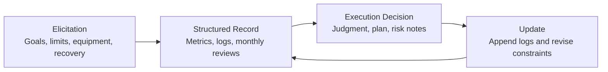
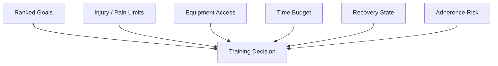
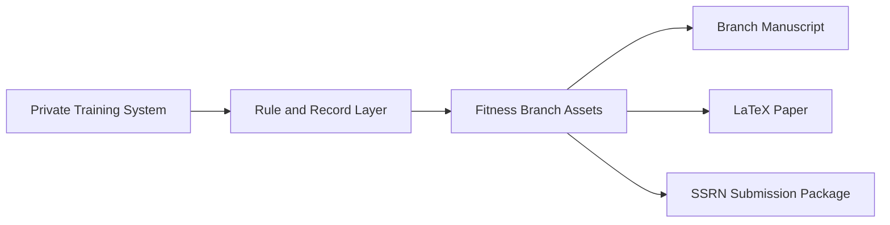

<!--
文件：manuscript.md
核心功能：作为 Fitness 分支论文的英文 markdown 稿，系统说明 AKM 如何在真实约束下把健身规划扩展为画像优先、约束保真、可复用的训练决策系统，并补充图表、比较框架与文献定位。
输入：健身工作区本地设计记录、训练日志、结构化状态记录、AKM 母框架口径与已核验参考文献。
输出：供人工审阅、GitHub 展示与后续 LaTeX 对齐使用的完整英文工作论文草稿。
-->

# Profile-First Fitness Planning Under Real Constraints: An AKM Branch Paper

## Abstract

Platforms such as OpenClaw, ChatGPT, and Gemini already provide persistent context surfaces for user and agent state, but they provide little guidance on how the state behind those surfaces should be elicited, structured, updated, and reused in real decision environments. OpenClaw makes this especially explicit through injected workspace files and system-prompt reconstruction. The gap becomes highly visible in fitness planning, where training decisions depend on ranked goals, injury history, recovery volatility, equipment access, and time budget. This paper presents the fitness branch of Active Knowledge Modeling (AKM) as a profile-first method for training decisions under real constraints. Instead of generating a workout plan first, the branch elicits and structures the state that should govern the decision, then routes downstream planning through an explicit execution contract. The contribution is methodological rather than outcome-validational. The paper clarifies why ordinary prompting, memory-only personalization, and split-based template logic break down in high-constraint training settings; specifies the three-layer branch workflow of elicitation, structured record, and execution decision; and shows how local design records can make workflow behavior inspectable without pretending to be broad clinical evidence. The broader claim is that in constrained fitness environments, better upstream user modeling can matter more than more fluent downstream phrasing.

## 1. Introduction

Platforms such as OpenClaw, ChatGPT, and Gemini already provide persistent context surfaces for user and agent state, but they rarely provide a rigorous method for constructing the state that should populate them. OpenClaw makes this especially explicit through injected workspace files and system-prompt reconstruction. In many tasks this omission is tolerable because the downside of generic output is only mediocre usefulness. In fitness planning the omission is more consequential. A generic answer can silently overwrite constraints that should dominate the decision: injury risk, movement limits, equipment availability, low recovery, or a hard session-time ceiling.

The problem is therefore upstream. If a training decision depends on body condition, recovery state, time budget, equipment access, and adherence risk, then the system should not begin with a plan. It should begin with a model of what can actually be advanced under the current constraints. The central AKM claim is that user understanding should become an explicit pre-task layer rather than a weak side effect of downstream dialogue.

That framing matters because fitness advice often looks more competent than it really is. A system can sound precise while quietly assuming stable readiness, generic movement capacity, or a template split that does not fit the operator. In practice, the user then pays the hidden cost through hesitation, low adherence, repeated clarification, or accumulated injury friction. Work on alignment debt helps name this hidden labor at the systems level [5], while related work on incentive structure and preference elicitation helps explain why seemingly capable agents still start too early [6]-[8]. The fitness branch of AKM is designed to prevent that early start.

## 2. Problem Landscape

### 2.1 Why generic fitness prompting fails

Generic fitness prompting degrades in predictable ways when upstream context is weak:

- injury or pain signals are flattened into normal programming assumptions
- equipment limitations are treated as details rather than determinants
- time budgets are treated as flexible when they are actually hard constraints
- recovery uncertainty is overwritten by split logic or template logic
- the system behaves as if confidence already exists even when key state variables are missing

These failure modes are not accidental style defects. They reflect a structural mismatch between what the decision actually depends on and what the workflow models explicitly. Research on training-load monitoring and autoregulation makes this point from a different angle: training quality depends on the interaction among workload, readiness, and context rather than on a fixed template alone [1]-[3]. Research on adherence further shows that exercise systems fail not only because the workout is suboptimal in theory, but because real-world delivery and execution conditions are mismatched to the operator [4].

### 2.2 Why existing platform context surfaces are still insufficient

The existence of a persistent context surface is not the same thing as a usable upstream method. In fitness, the missing pieces are usually not raw data volume but state construction discipline:

- the system does not force goal ranking before plan generation
- the system does not distinguish hard limits from soft preferences
- the system does not persist recent execution evidence as a reusable state layer
- the system does not surface uncertainty as an explicit output object

That is why fitness planning remains a strong example of the AKM thesis. Existing platform affordances allow users to store or inject context, but they do not define how the state behind those surfaces should be elicited, structured, updated, and reloaded before the next decision.

## 3. Branch Method

The fitness branch does not model identity for its own sake. It models **training feasibility**. The operator state that matters is the state that can invalidate or reshape a session.

### 3.1 Workflow overview



The branch uses a stable four-step logic:

1. ask what kind of session would even be legitimate
2. persist the answer as reusable upstream state
3. issue a bounded decision rather than a generic plan
4. update the record after execution or non-execution

### 3.2 Elicitation layer

The elicitation layer clarifies which variables are decision-critical before any recommendation is emitted. At minimum it seeks:

- ranked goals
- injury history and movement restrictions
- available equipment
- weekly frequency expectations
- session time budget
- recovery state
- adherence and execution risk

The questions are not there to make the answer feel personalized. They are there to decide whether a recommendation should exist at all.

### 3.3 Structured record layer

The elicited information is converted into persistent upstream state. In this branch, state is maintained through metrics snapshots, equipment records, append-only logs, day-level decision files, and monthly retrospective summaries. That means the branch can refer to prior load, recurring constraints, or prior non-compliance without re-deriving the user from scratch each session.

| Record Type | Example Source | Role in the Workflow |
| --- | --- | --- |
| Rules | `.cursor/rules/rule.mdc` | defines hard boundaries, output contract, and non-negotiables |
| Body state | `body_metrics.md` | maintains baselines, constraints, and performance anchors |
| Equipment context | `equip.md` | limits exercise selection to the actual environment |
| Day-level framing | `today.md` | captures current state and immediate decision context |
| Execution log | `training_log.md` | records what actually happened, not just what was advised |
| Monthly review | monthly files | tracks stage-level drift, progress, and recurring bottlenecks |

### 3.4 Execution decision layer

Only after profile and recent state are available does the system produce a training decision. The output contract includes:

- `StateJudgment`
- `PrimaryDecision`
- `DecisionConfidence`
- `Plan`
- `RiskNotes`
- `NonNegotiables`
- `MissingInputs`

Missing information is treated as part of the decision rather than something to hide behind fluent language.

### 3.5 Variable map



The variable map shows why the branch must remain profile-first. Any one of these inputs can invalidate what looks like a good session on paper.

## 4. Design Record and Reference Trace

The local design record for this branch is listed in [local-evidence.md](./local-evidence.md). These records are not presented as broad proof of effectiveness. They are used to make workflow behavior visible and to show that the branch is a long-running decision system rather than a single polished prompt.

### 4.1 Representative decision trace

```json
{
  "StateJudgment": "Recovery state partially unclear; lower-back risk remains a live constraint.",
  "PrimaryDecision": "Do not assign heavy compound lifting today. Use a lower-risk session or pause pending clarification.",
  "DecisionConfidence": "Low",
  "Plan": [
    "Confirm current lumbar discomfort level and sleep quality before loading decisions.",
    "If discomfort is elevated, switch to mobility, light accessories, and walking.",
    "If discomfort is low and recovery is acceptable, resume with conservative volume only."
  ],
  "RiskNotes": [
    "Generic split logic is not sufficient under unresolved recovery and injury uncertainty.",
    "The main failure mode is acting as if readiness were already known."
  ],
  "NonNegotiables": [
    "No heavy axial loading until state is clarified.",
    "Do not infer readiness from schedule alone."
  ],
  "MissingInputs": [
    "Current lumbar discomfort score (1-10)",
    "Previous session load and residual soreness",
    "Sleep and recovery status over the last 24 hours"
  ]
}
```

This trace is valuable because it shows what the system does when certainty is low. It does not fake a stable program. It contracts the decision space.

### 4.2 Evidence path



The evidence path matters for two reasons. First, it shows that the public branch is not detached from a real operating system. Second, it clarifies that the paper is downstream of design records, not downstream of a one-off demo answer.

## 5. Comparative Discussion

The real comparison is not between one workout split and another. It is between different ways of handling upstream user state.

| Approach | What It Sees | Typical Failure Mode | Result Under Real Constraints |
| --- | --- | --- | --- |
| Generic prompt | current user message only | assumes normal readiness and generic equipment | fluent but fragile |
| Memory-only personalization | scattered prior fragments | lacks decision contract and uncertainty discipline | more context, still unstable |
| Template split logic | program archetype | treats schedule and body as already solved | overconfident and rigid |
| AKM fitness branch | explicit elicitation + persistent state + bounded output | narrower answer surface | slower but more usable |

This comparison is where AKM adds conceptual value. It is not merely “more personalized fitness prompting.” It is a change in where the decision starts.

That shift also changes what counts as a good answer. In a generic assistant, a good answer often means a detailed session. In the AKM fitness branch, a good answer may be a refusal to issue heavy programming because the state is underdetermined. The narrower answer is the higher-quality decision.

The branch also changes how operator labor is spent. Without a profile-first layer, the user repeatedly restates goals, injury constraints, or recovery facts. With a structured upstream layer, that labor is converted into reusable context capital. This does not eliminate the need for future updates, but it changes them from repeated re-explanation to bounded state maintenance [5]-[8].

## 6. Boundaries and Failure Modes

This paper is not a medical paper. The branch does not replace physicians, rehabilitation specialists, or in-person coaching. Its claim is narrower: AKM can be implemented as a profile-first planning system in a high-constraint training environment.

The branch can still fail. The main failure modes are:

- stale state that no longer matches current recovery or injury reality
- insufficient honesty at the elicitation stage
- incorrect transfer from private constraints to public branch assets
- downstream misuse when a user treats the branch as a medical authority

These are not arguments against the method. They are arguments for preserving explicit uncertainty and update discipline inside the workflow.

## 7. Conclusion

The fitness branch matters because it shows how AKM converts workout generation into a decision process grounded in user state, constraints, and explicit uncertainty. The contribution is methodological: better upstream modeling can matter more than better downstream phrasing.

The branch therefore supports a stronger claim than “fitness can be personalized.” The stronger claim is that personalization quality depends on whether the system has first built a reusable operator model with enough structure to govern the next decision. In constrained training environments, that upstream layer is not an accessory. It is the main system.

## References

[1] Foster, C., Rodriguez-Marroyo, J. A., & de Koning, J. J. (2017). *Monitoring Training Loads: The Past, the Present, and the Future*. International Journal of Sports Physiology and Performance, 12(S2), S2-2-S2-8. DOI: 10.1123/ijspp.2016-0388.

[2] Shattock, K., & Tee, J. C. (2022). *Autoregulation in Resistance Training: A Comparison of Subjective Versus Objective Methods*. Journal of Strength and Conditioning Research, 36(3), 641-648. DOI: 10.1519/JSC.0000000000003530.

[3] Haddad, M., Stylianides, G., Djaoui, L., Dellal, A., & Chamari, K. (2017). *Session-RPE Method for Training Load Monitoring: Validity, Ecological Usefulness, and Influencing Factors*. Frontiers in Neuroscience, 11, 612. DOI: 10.3389/fnins.2017.00612.

[4] Fuente-Vidal, A., Guerra-Balic, M., Roda-Noguera, O., Jerez-Roig, J., & Montane, J. (2022). *Adherence to eHealth-Delivered Exercise in Adults with no Specific Health Conditions: A Scoping Review on a Conceptual Challenge*. International Journal of Environmental Research and Public Health, 19(16), 10214. DOI: 10.3390/ijerph191610214.

[5] Oyemike, C., Akpan, E., & Herve-Berdys, P. (2025). *Alignment Debt: The Hidden Work of Making AI Usable*. arXiv:2511.09663.

[6] Holstein, J., Hemmer, P., Satzger, G., & Sun, W. (2025). *When Thinking Pays Off: Incentive Alignment for Human-AI Collaboration*. arXiv:2511.09612.

[7] Foschini, M., Defresne, M., Gamba, E., Bogaerts, B., & Guns, T. (2025). *Preference Elicitation for Step-Wise Explanations in Logic Puzzles*. arXiv:2511.10436.

[8] White, J., Fu, Q., Hays, S., Sandborn, P., Olea, C., Gilbert, H., Elnashar, A., Spencer-Smith, J., & Schmidt, D. C. (2023). *A Prompt Pattern Catalog to Enhance Prompt Engineering with ChatGPT*. arXiv:2302.11382.


