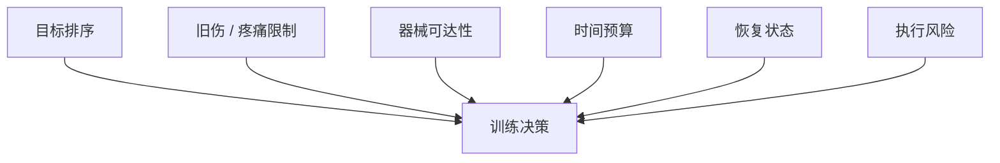
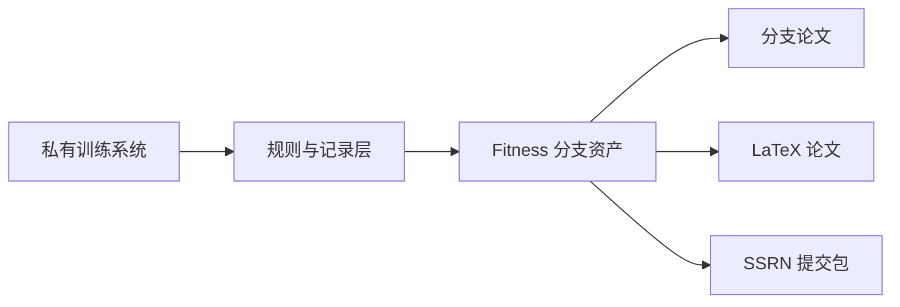

<!--
文件：manuscript.zh-CN.md
核心功能：作为 Fitness 分支论文的中文 markdown 稿，系统说明 AKM 如何在真实约束下把健身规划扩展为画像优先、约束保真、可复用的训练决策系统，并补充图表、比较框架与文献定位。
输入：健身工作区本地设计记录、训练日志、结构化状态记录、AKM 母框架口径与已核验参考文献。
输出：供人工审阅与英文主稿同步使用的完整中文工作论文草稿。
-->

# Profile-First Fitness Planning Under Real Constraints: An AKM Branch Paper

## 摘要

OpenClaw、ChatGPT、Gemini 这类平台已经提供了用户与 agent 状态的上下文承载面，但在真实决策环境中，这些承载面背后的状态到底该如何被挖掘、结构化、更新和复用，平台几乎没有给出方法。其中 OpenClaw 通过 injected workspace files 和 system-prompt reconstruction 把这件事做得最显式。Fitness 分支把 `Active Knowledge Modeling (AKM)` 落成了一种面向真实约束的画像优先训练决策方法。系统不是先生成训练计划，而是先建模目标排序、旧伤限制、器械可达性、时间预算、恢复不确定性和执行风险，再进入训练建议。本文的贡献是方法论层面的，而不是效果验证层面的。论文解释了为什么普通 prompting、记忆碎片式个性化、模板分化逻辑在高约束训练场景下会持续失真；也说明了 Fitness 分支如何通过 `Elicitation -> Structured Record -> Execution Decision` 的工作流，把用户建模前移成一个稳定决策层。本文使用本地设计记录与代表性决策样本来展示工作流行为，而不是宣称广义疗效。

## 1. 引言

OpenClaw、ChatGPT、Gemini 这类平台已经提供了用户与 agent 状态的上下文承载面，但很少给出一套严肃的状态构建方法，告诉用户这些承载面里到底该放什么。OpenClaw 通过 injected workspace files 和 system-prompt reconstruction 把这一点做得最显式。在很多任务里，这种缺口只会造成回答普通、不够贴人。但在健身规划中，代价更高：一个看似流畅的建议，可能悄悄覆盖掉旧伤、低恢复、器械限制或时间上限这些本来应该压倒性主导决策的约束。

因此，问题首先出在上游。如果训练决策取决于身体状态、恢复情况、时间预算和器械可达性，那么系统就不该先给计划，而应先建立一个关于“当前到底能推进什么”的模型。AKM 的核心主张就是：用户理解必须成为一个明确的前置层，而不是下游对话里偶然冒出来的副产物。

这件事之所以重要，是因为健身建议往往会显得比它实际更可靠。系统可能说得很像回事，但它默认了稳定恢复、正常动作能力或某种通用训练分化，而这些默认前提恰恰可能是错的。结果就是用户承担隐形成本：犹豫、低执行率、反复解释，甚至不断累积伤病摩擦。对齐债务相关研究帮助我们给这种隐形劳动命名 [5]，而偏好挖掘与激励结构研究则解释了为什么看似聪明的 agent 仍会过早开工 [6]-[8]。Fitness 分支就是为了解决这种“开工太早”的结构问题。

## 2. 问题图景

### 2.1 为什么普通健身 prompting 会失真

当上游上下文不足时，普通健身 prompting 会稳定地出现以下问题：

- 旧伤或疼痛信号被压平成普通训练前提
- 器械限制被当成细节而不是决定因素
- 时间预算被当成可调变量，哪怕它其实是硬约束
- 恢复不确定性被训练分化模板直接覆盖
- 关键状态变量缺失时，系统仍假装自己有信心

这些问题不是写作风格上的小毛病，而是“决策真正依赖什么”和“系统显式建模了什么”之间的结构性错位。训练负荷监测、自适应训练和依从性研究都从不同角度说明：训练质量取决于负荷、准备状态和场景条件之间的互动，而不是单靠一个模板 [1]-[4]。

### 2.2 为什么现有平台上下文承载面仍不够

有上下文承载面，不等于有上游方法。Fitness 场景里真正缺的通常不是信息量，而是状态构建纪律：

- 系统不会强迫你先排目标，再出方案
- 系统不会区分硬限制和软偏好
- 系统不会把近期执行证据整理成可复用状态层
- 系统不会把不确定性显式输出

这正是 Fitness 分支能证明 AKM 价值的地方。平台允许用户存放或注入上下文，但并没有规定这些承载面背后的状态如何被挖掘、结构化、更新和重载到下一次决策之前。

## 3. 分支方法

Fitness 分支建模的不是抽象身份，而是**训练可行性**。真正重要的状态，是那些足以使一堂训练课失效、缩窄或重排的状态。

### 3.1 工作流总览


这个分支用的是稳定四步逻辑：

1. 先问“什么样的训练课才合法”
2. 再把答案固化成可复用状态
3. 接着输出有边界的决策，而不是泛计划
4. 最后根据执行或未执行情况更新状态层

### 3.2 Elicitation 层

Elicitation 层的任务，是在任何建议出现之前，把真正决定训练是否合法的变量问清楚。最少包括：

- 目标排序
- 旧伤与动作限制
- 可用器械
- 每周训练频率预期
- 单次时长预算
- 恢复状态
- 执行风险与依从性风险

这也是 Fitness 分支和“prompt 修饰”分道扬镳的地方。这里的问题不是为了让回答“更像个性化”，而是为了决定一个建议是否应该存在。

### 3.3 Structured Record 层

挖出的信息会被转成持久化的上游状态。在这个分支里，这层状态通过指标快照、器械记录、追加式日志、日级决策文件和月度复盘来维护。这样，系统就能在下一次决策中引用先前负荷、重复性约束或执行偏差，而不是每次都重新猜用户。

| 记录类型 | 示例来源 | 在工作流中的作用 |
| --- | --- | --- |
| 规则 | `.cursor/rules/rule.mdc` | 定义硬边界、输出契约和不可谈判项 |
| 身体状态 | `body_metrics.md` | 维护基线、限制和性能锚点 |
| 器械上下文 | `equip.md` | 把动作选择限制在真实环境里 |
| 日级决策 | `today.md` | 捕捉当前状态和立即决策语境 |
| 执行日志 | `training_log.md` | 记录实际发生了什么，而不只是建议过什么 |
| 月度复盘 | 月度文件 | 跟踪阶段进展、偏移和反复出现的瓶颈 |

### 3.4 Execution Decision 层

只有在画像和近期状态都具备后，系统才产出训练决策。输出契约包括：

- `StateJudgment`
- `PrimaryDecision`
- `DecisionConfidence`
- `Plan`
- `RiskNotes`
- `NonNegotiables`
- `MissingInputs`

这个契约很重要，因为它防止系统用文风掩盖不确定性。缺失信息会成为结果的一部分。如果 readiness 没闭合，那这个“不闭合”就应该出现在结果里，而不是被模板化训练单覆盖掉。

### 3.5 变量结构图



这个变量图说明了为什么 Fitness 分支必须是画像优先。这里任意一个输入都足以让纸面上“看起来不错”的训练课变得不合法。

## 4. 设计记录与证据路径

这个分支的本地设计记录列在 [local-evidence.md](./local-evidence.md) 中。这些记录不是广义效果证明，而是用来让工作流行为可见，证明 Fitness 分支是一个长期运行的决策系统，而不是一句包装精巧的 prompt。

### 4.1 代表性决策样本

```json
{
  "StateJudgment": "Recovery state partially unclear; lower-back risk remains a live constraint.",
  "PrimaryDecision": "Do not assign heavy compound lifting today. Use a lower-risk session or pause pending clarification.",
  "DecisionConfidence": "Low",
  "Plan": [
    "Confirm current lumbar discomfort level and sleep quality before loading decisions.",
    "If discomfort is elevated, switch to mobility, light accessories, and walking.",
    "If discomfort is low and recovery is acceptable, resume with conservative volume only."
  ],
  "RiskNotes": [
    "Generic split logic is not sufficient under unresolved recovery and injury uncertainty.",
    "The main failure mode is acting as if readiness were already known."
  ],
  "NonNegotiables": [
    "No heavy axial loading until state is clarified.",
    "Do not infer readiness from schedule alone."
  ],
  "MissingInputs": [
    "Current lumbar discomfort score (1-10)",
    "Previous session load and residual soreness",
    "Sleep and recovery status over the last 24 hours"
  ]
}
```

这个样本的价值在于，它展示了系统在低确定性条件下如何收缩决策空间，而不是假装存在稳定训练方案。

### 4.2 证据路径



这条证据路径重要有两个原因。第一，它证明公开分支不是脱离真实系统的壳。第二，它说明论文是设计记录的下游产物，而不是某次漂亮 demo 的包装。

## 5. 比较性讨论

真正应该比较的，不是某个训练分化和另一个训练分化，而是不同的上游用户状态处理方式。

| 方案 | 看见什么 | 典型失败模式 | 在真实约束下的表现 |
| --- | --- | --- | --- |
| 普通 prompt | 只有当前用户消息 | 默认正常 readiness 和通用器械 | 流畅但脆弱 |
| 记忆碎片式个性化 | 零散旧信息 | 缺少决策契约和不确定性纪律 | 有上下文但不稳定 |
| 模板分化逻辑 | 某种计划原型 | 把身体和时间当成已解决问题 | 过于自信且僵硬 |
| AKM Fitness 分支 | 显式挖掘 + 持久状态 + 有边界输出 | 答案表面更窄 | 更慢，但更可执行 |

这正是 AKM 的概念增益所在。它不是“更个性化的健身 prompt”，而是改变了决策从哪里开始。

这个变化也改变了“什么叫好答案”。在普通 assistant 里，好答案常常是一堂尽可能完整的课；在 Fitness 分支里，好答案可能恰恰是拒绝安排高负荷训练，因为当前状态不足以支持这种安排。答案更窄，反而质量更高。

同时，这个分支也改变了用户劳动的去向。没有画像优先层时，用户会反复重述目标、旧伤和恢复事实；有了结构化上游层后，这些劳动会被沉淀成可复用的上下文资本。它并不消灭未来更新，但会把“反复解释自己”改写成“维护状态层” [5]-[8]。

## 6. 边界与失效模式

这不是医学论文。这个分支不替代医生、康复师或线下教练。它的主张更窄：AKM 可以被实现为一个高约束训练环境中的画像优先规划系统。

它也仍然会失效。主要失效模式包括：

- 状态层过期，不再匹配当前恢复或伤病现实
- 挖掘阶段不够诚实，导致错误输入被结构化固化
- 从私有约束迁移到公开分支时发生失真
- 用户把它错当成医学权威使用

这些都不是反驳这个方法的理由，而是要求系统保留显式不确定性和更新纪律的理由。

## 7. 结论

Fitness 分支的重要性在于，它展示了 AKM 如何把“生成训练单”改写成一个建立在用户状态、约束和显式不确定性之上的决策过程。它的贡献是方法论的：在高约束训练环境中，更好的上游建模可能比更漂亮的下游措辞更重要。

因此，这个分支支持的并不只是“健身可以被个性化”这样一个常识性结论。更强的结论是：个性化质量取决于系统是否先建立了足够稳定、足够结构化、足以约束下一次决策的操作者模型。在高约束训练环境里，这个上游层不是装饰，而是系统本体。

## 参考文献

[1] Foster, C., Rodriguez-Marroyo, J. A., & de Koning, J. J. (2017). *Monitoring Training Loads: The Past, the Present, and the Future*. International Journal of Sports Physiology and Performance, 12(S2), S2-2-S2-8. DOI: 10.1123/ijspp.2016-0388.

[2] Shattock, K., & Tee, J. C. (2022). *Autoregulation in Resistance Training: A Comparison of Subjective Versus Objective Methods*. Journal of Strength and Conditioning Research, 36(3), 641-648. DOI: 10.1519/JSC.0000000000003530.

[3] Haddad, M., Stylianides, G., Djaoui, L., Dellal, A., & Chamari, K. (2017). *Session-RPE Method for Training Load Monitoring: Validity, Ecological Usefulness, and Influencing Factors*. Frontiers in Neuroscience, 11, 612. DOI: 10.3389/fnins.2017.00612.

[4] Fuente-Vidal, A., Guerra-Balic, M., Roda-Noguera, O., Jerez-Roig, J., & Montane, J. (2022). *Adherence to eHealth-Delivered Exercise in Adults with no Specific Health Conditions: A Scoping Review on a Conceptual Challenge*. International Journal of Environmental Research and Public Health, 19(16), 10214. DOI: 10.3390/ijerph191610214.

[5] Oyemike, C., Akpan, E., & Herve-Berdys, P. (2025). *Alignment Debt: The Hidden Work of Making AI Usable*. arXiv:2511.09663.

[6] Holstein, J., Hemmer, P., Satzger, G., & Sun, W. (2025). *When Thinking Pays Off: Incentive Alignment for Human-AI Collaboration*. arXiv:2511.09612.

[7] Foschini, M., Defresne, M., Gamba, E., Bogaerts, B., & Guns, T. (2025). *Preference Elicitation for Step-Wise Explanations in Logic Puzzles*. arXiv:2511.10436.

[8] White, J., Fu, Q., Hays, S., Sandborn, P., Olea, C., Gilbert, H., Elnashar, A., Spencer-Smith, J., & Schmidt, D. C. (2023). *A Prompt Pattern Catalog to Enhance Prompt Engineering with ChatGPT*. arXiv:2302.11382.


